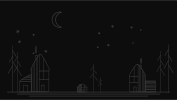

# Gentle soil

-- sustainability blog --

## Overview

An ongoing collection of notes and articles on environmental and other topics

- environmental challenges (and possible solutions?)
- tech and its ethical implications
- social and furture perspectives
- experiments in sustainable and gentle living

The aim is to explore, share, and write. The scope may evolve over time.

---

## Index

- [Gentle Space: On Micro-Living](./articles/gentle-space.md)

  

---

- [Restoring What Was Lost](./articles/restoring-what-was-lost.md)

---

## License

Content is licensed under [CC BY-NC 4.0](https://creativecommons.org/licenses/by-nc/4.0/).  
You are free to share and adapt the material with attribution to the author’s pen name.  
Commercial use is not permitted without additional permission.

---
